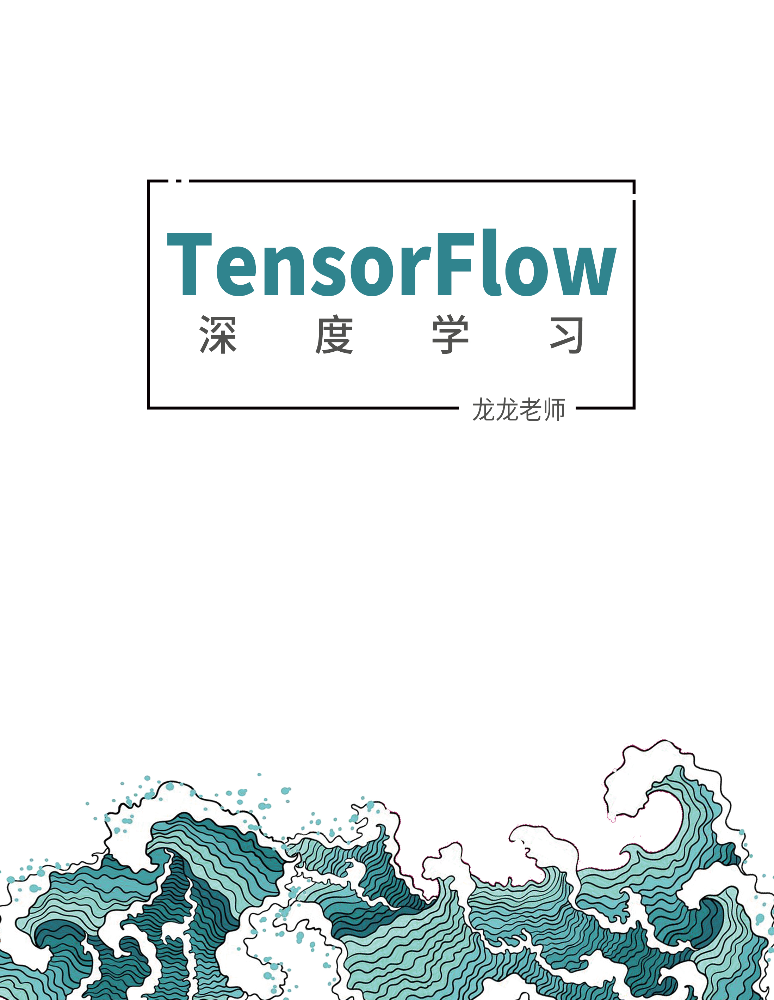
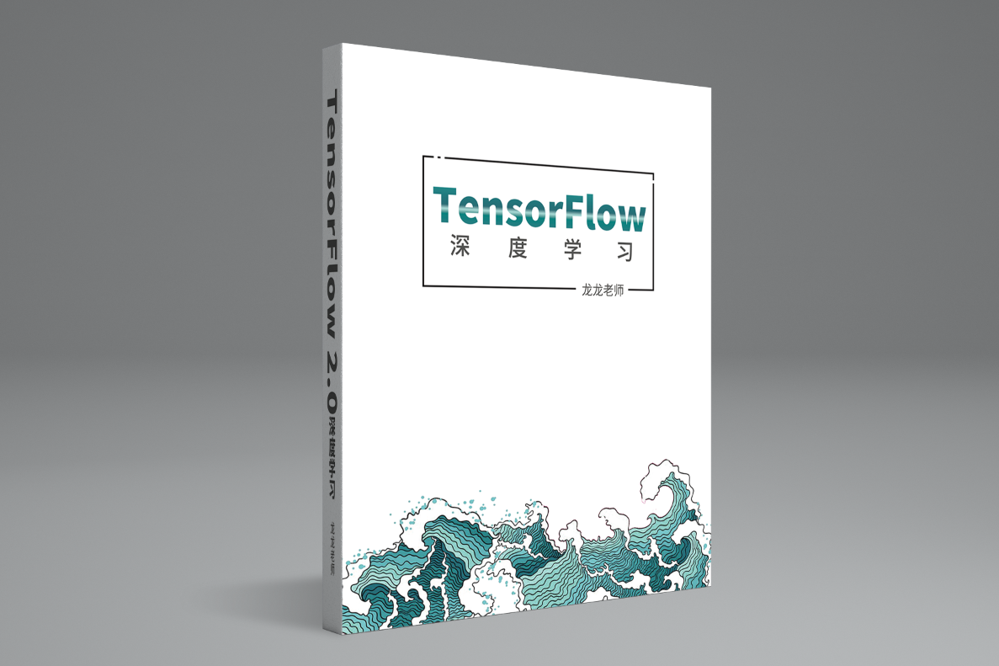
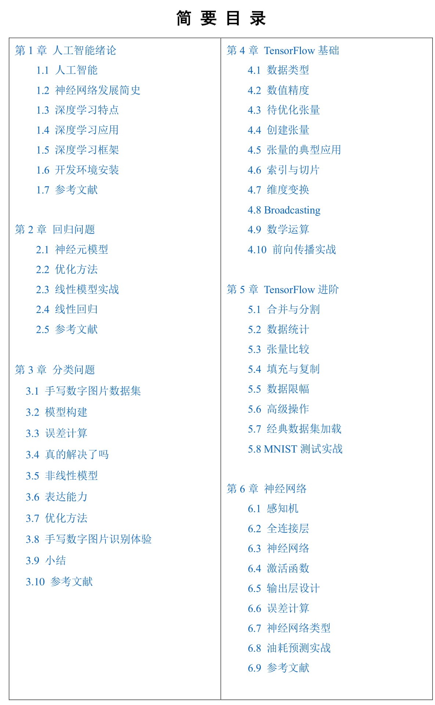
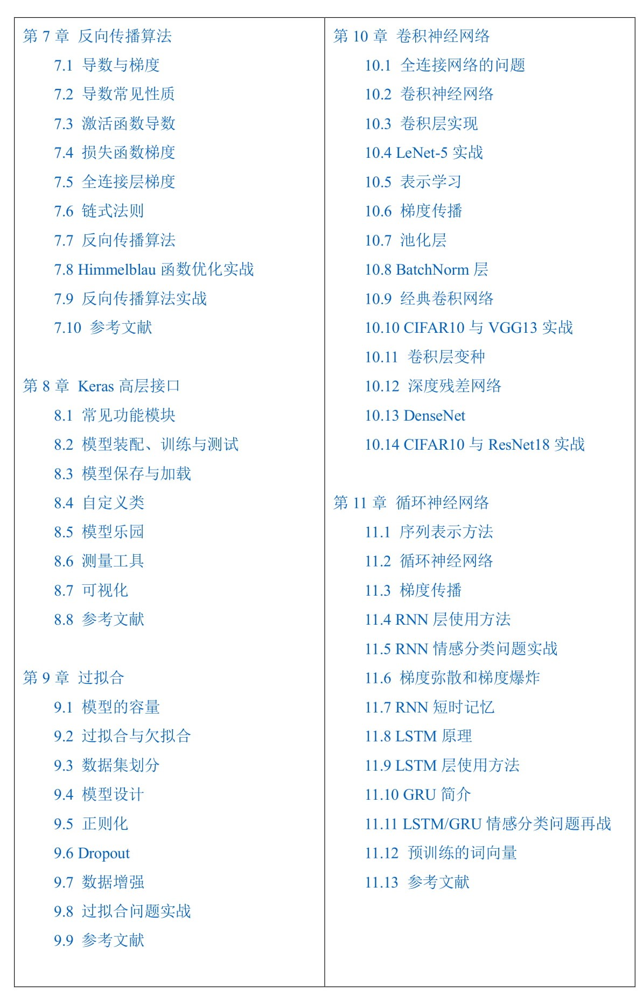
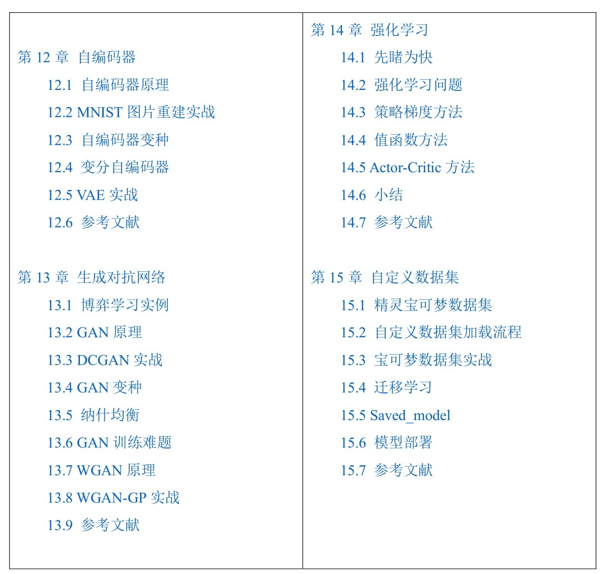

# TensorFlow 2.0深度学习开源书

基于TensorFlow 2.0正式版！！！

包含电子书，配套源代码等，时间仓促，源代码还没有整理完全。

>主页上方有个“Clone or Download”绿色按钮，下载整个仓库即可。之所以显示在线打不开是因为Github在国外，连接不稳定就会提示打不开。

  
  

-	提交错误或者修改等反馈意见，请在Github Issues页面提交：

https://github.com/dragen1860/Deep-Learning-with-TensorFlow-book/issues

-	TensorFlow 2.0 实战案例：
https://github.com/dragen1860/TensorFlow-2.x-Tutorials

-	联系邮箱(一般问题建议Github issues交流)：liangqu.long AT gmail.com

- 使用本开源书本的任何内容时(仅限个人的非商业用途)，请注明作者和Github链接

# 目录

  
  
  

